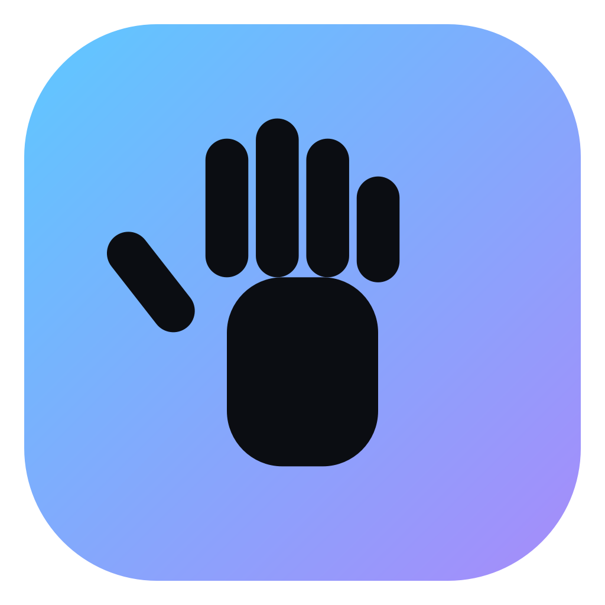

<p align="center">
  
</p>

<h1 align="center">Hand Gesture Control</h1>

<p align="center">
  <strong>Real-time hand tracking and gesture-based desktop control.</strong>
</p>

<p align="center">
  A local-first desktop application for controlling system actions through hand gestures,
  with real-time tracking, custom gesture recording, gesture-to-action mapping,
  and continuous pinch-to-volume control.
</p>

<p align="center">
  
  
  
</p>

---

## Overview

**Hand Gesture Control** is a real-time computer-vision desktop application that turns hand movements into configurable system actions.

It is designed as an extensible application rather than a simple webcam demonstration. The system separates camera I/O, hand detection, tracking, geometric analysis, gesture recognition, action dispatch, rendering, and configuration into independent layers.

The application supports:

* Two-hand tracking
* Stable hand identities
* Finger-state classification
* Built-in static gestures
* Custom recorded gestures
* Finger snap detection
* Pinch-to-volume control
* Configurable gesture-to-action mappings
* Real-time performance monitoring
* Local-first processing
* Windows packaging with PyInstaller

---

## Highlights

### Real-time hand tracking

* Tracks up to two hands.
* Maintains stable identities across frames.
* Provides handedness and confidence information.
* Tolerates short periods of occlusion.
* Handles invalid landmark values without taking down the pipeline.

### Finger-state analysis

Each finger is classified as:

* Extended
* Folded
* Partial
* Unknown

Classification is based on scale- and rotation-aware geometry, including:

* Joint angles
* Finger straightness
* Palm geometry
* Relative distances
* Thumb-specific geometry

### Built-in gestures

The application includes:

* Open palm
* Fist
* Pointing
* Thumb up
* Thumb down
* Peace / V
* OK
* Pinch
* Three fingers
* Four fingers

Gestures use temporal confirmation and edge-triggered activation to reduce accidental repeated actions.

### Special interactions

**Finger snap**

Detected using temporal motion characteristics such as closing velocity, a detection window, and cooldown logic.

**Pinch-to-volume**

Thumb/index distance is normalized against hand scale and smoothed using an EMA-based controller with a configurable dead zone.

---

## Custom Gestures

The application can record and recognize user-defined static hand poses without modifying source code.

### Recording workflow

1. Open **Mapping → Record New Gesture**
2. Hold the desired pose.
3. Capture approximately 0.7 seconds of samples.
4. Samples are averaged into a representative gesture.
5. Give the gesture a name.
6. Assign an available action.
7. Enable or disable the gesture and configure its cooldown.

The new gesture becomes available immediately.

### Hand and mirror agnostic matching

Custom gestures do not store raw landmark coordinates.

Instead, the system stores normalized structural characteristics such as:

* Finger curl ratios
* Thumb angle
* Normalized pinch distance

This makes matching substantially less dependent on:

* Hand position
* Scale
* Camera distance
* Left/right hand orientation
* Mirror mode

Implementation:

`app/gestures/custom_gestures.py`

---

## Gesture Mapping

Gesture-to-action mappings are configurable through the application UI.

Each mapping can have its own:

* Enabled/disabled state
* Cooldown
* Action
* Configuration

### Default mappings

| Gesture       | Action                        | Default  |
| ------------- | ----------------------------- | -------- |
| Pinch         | Continuous system volume      | Enabled  |
| Finger snap   | Camera snapshot               | Enabled  |
| Open palm     | Pause/resume tracking         | Enabled  |
| Fist          | Cancel current mode           | Disabled |
| Thumb up/down | Confirmation/cancellation log | Disabled |
| Peace         | Toggle skeleton overlay       | Disabled |

Disruptive system actions are intentionally disabled by default.

---

## Architecture

The application follows a layered, multi-threaded architecture:

```text
Camera Capture
      │
      │ newest frame only
      ▼
Frame Pipeline
      │
      ├── Hand Detector Backend
      │
      ├── Multi-Hand Tracker
      │
      ├── Landmark Smoother
      │
      ├── Geometry Engine
      │
      ├── Finger-State Classifier
      │
      ├── Gesture Engine
      │     ├── Static Gestures
      │     ├── Custom Gestures
      │     ├── Finger Snap
      │     └── Cooldowns / Confirmation
      │
      ├── Action Dispatcher
      │
      ├── Pinch-Volume Controller
      │
      └── Overlay Renderer
      │
      ▼
Qt Queued Signal
      │
      ▼
Main Window / GUI Thread
```

The GUI remains responsive because camera acquisition and frame processing do not run on the main UI thread.

---

## Project Structure

```text
HandGestureControl/
│
├── app/
│   ├── main_window.py
│   │
│   ├── camera/
│   │   ├── capture/
│   │   └── ...
│   │
│   ├── vision/
│   │   ├── backend/
│   │   ├── geometry/
│   │   ├── finger_state/
│   │   ├── smoothing/
│   │   └── ...
│   │
│   ├── tracking/
│   │
│   ├── gestures/
│   │
│   ├── actions/
│   │
│   ├── pipeline/
│   │
│   ├── ui/
│   │
│   ├── config/
│   │
│   └── utils/
│
├── assets/
│   └── icon/
│       └── app_icon.png
│
├── tests/
│
├── scripts/
│   ├── benchmark.py
│   ├── download_models.py
│   └── ...
│
├── configs/
│
├── docs/
│
├── main.py
├── requirements.txt
├── LICENSE
└── README.md
```

---

## Detection Backend

The detection layer is backend-agnostic.

The application currently supports a MediaPipe Tasks `HandLandmarker` backend and includes a mock backend for development and testing.

The backend interface is based around application-level structures such as:

```text
HandObservation
FrameResult
```

This allows the detector implementation to be replaced without rewriting the rest of the pipeline.

### MediaPipe timestamp handling

The backend generates strictly monotonic timestamps internally using a lock-protected monotonic clock.

This prevents duplicate timestamp failures during:

* Fast frame processing
* Camera reconnects
* Backend reinitialization
* Concurrent execution

### GPU / CPU fallback

The backend attempts GPU acceleration first and falls back to CPU when necessary.

The fallback state is cached for the running process.

---

## Temporal Smoothing

Landmarks are filtered independently for each hand using a **One Euro Filter**.

Filtering is applied to both:

* Image-space landmarks
* Metric/world-space landmarks

This allows downstream geometric calculations to benefit from the same smoothing pipeline rather than operating on unsmoothed world coordinates.

---

## Real-Time Frame Handling

The system intentionally avoids building a frame queue.

Instead:

```text
Camera
  │
  └── newest frame
          │
          ▼
      Processing
          │
          ▼
        Result
```

Older frames are discarded when processing falls behind.

This prioritizes **current state and responsiveness** over processing every captured frame.

---

## Thread Safety

Several mechanisms are used depending on the execution context.

### Qt queued connections

Qt signals are used when communicating with QObject-based targets that live on the GUI event-loop thread.

### GUI invocation

`GuiInvoker` safely schedules arbitrary GUI callbacks originating from worker threads.

### Mutex-guarded state

Camera and pipeline worker loops use mutex-protected pending state where the worker does not continuously pump a Qt event loop.

### Background executor

Blocking system operations such as volume and media-key calls can be dispatched to a background executor so they do not stall the real-time pipeline.

---

## Configuration

Application configuration is validated before being applied.

The validation layer handles:

* Invalid numeric values
* NaN / infinite values
* Unknown enum values
* Inverted ranges
* Out-of-range settings
* Non-numeric input
* Missing fields

Invalid values are clamped or replaced with safe defaults.

Configuration also contains:

```text
schema_version
```

with a migration hook for future schema changes.

---

## Camera Handling

Camera management is designed to avoid blocking the GUI.

Features include:

* Asynchronous camera enumeration
* Bounded device probing
* Early termination after valid devices are found
* Fallback to the first available camera
* User notification when the requested device is unavailable
* Interruptible reconnect logic
* Exponential reconnect backoff

Reconnect delay:

```text
0.5s → 1s → 2s → 4s → 8s
```

---

## Performance

The application exposes live performance information including:

* FPS
* Frame time
* Detection latency
* Dropped frames

UI performance metrics are throttled rather than updated every frame.

A standalone benchmark is available:

```bash
python scripts/benchmark.py --seconds 15
```

For headless pipeline benchmarking:

```bash
python scripts/benchmark.py --backend mock --seconds 10
```

Performance can be affected by:

* Camera resolution
* Lighting
* Number of tracked hands
* Detector backend
* GPU availability
* Rendering mode
* Camera contention
* Gesture confirmation time

---

## Installation

### Requirements

* Python 3.10+
* Webcam
* Windows, Linux, or macOS for source execution
* Internet access only for the optional one-time model download

Create a virtual environment:

```bash
python -m venv .venv
```

Activate it on Windows:

```powershell
.venv\Scripts\activate
```

Install dependencies:

```bash
pip install -r requirements.txt
```

Download the hand-landmark model:

```bash
python scripts/download_models.py
```

The model is approximately 7–8 MB and is not committed to the repository.

---

## Running from Source

Start the application with:

```bash
python main.py
```

If the model is missing, the application reports the problem through the UI.

For headless development and testing, select:

```text
Settings
→ Detection
→ Backend
→ mock
```

The mock backend generates a synthetic animated hand and does not require a camera or GPU.

---

## Windows Build

A Windows packaging workflow is provided through:

```text
build_windows.bat
```

The build process:

1. Creates an isolated build environment.
2. Installs dependencies.
3. Downloads the model.
4. Generates required assets.
5. Runs PyInstaller.
6. Produces the packaged application.

Expected output:

```text
dist/
└── HandGestureControl/
    └── HandGestureControl.exe
```

A release archive can be created with:

```text
make_release_zip.bat
```

Output:

```text
release/
└── HandGestureControl.zip
```

### Why folder-based packaging?

A folder-based build is intentionally used instead of a one-file executable.

The application depends on relatively large libraries such as:

* MediaPipe
* OpenCV
* Qt

A one-file build would need to extract a large payload during every launch.

---

## Windows Packaging Status

The packaging workflow and resource-resolution logic have been tested in a Linux sandbox.

The following still require native Windows verification before being described as fully release-validated:

* Windows-native DLL loading
* Webcam access
* Windows icon integration
* `pycaw`
* `comtypes`
* Final Windows runtime behavior

PyInstaller does not cross-compile Windows executables from Linux.

---

## Optional System Actions

Some actions depend on platform-specific packages.

### Windows

Optional integrations include:

* `pyautogui` for media keys
* `pycaw` + `comtypes` for system volume control

### Linux

Supported volume commands may use:

```text
pactl
amixer
```

### macOS

Volume control can use:

```text
osascript
```

Unavailable optional dependencies disable the affected actions rather than breaking the application.

---

## Testing

The project contains an automated test suite covering core application logic without requiring:

* A physical camera
* A GPU
* The real hand-landmark model

Synthetic hand fixtures are used where appropriate.

Important test areas include:

* Gesture recognition
* Custom gestures
* Finger-state classification
* Tracking
* Configuration validation
* Pipeline behavior
* Thread-safety regressions
* Camera handling
* Resource resolution
* Hardening regressions

Qt tests can run headlessly with:

```text
QT_QPA_PLATFORM=offscreen
```

---

## Engineering Hardening

Several real-world failure modes have been explicitly addressed.

### Fixed issues

* MediaPipe duplicate timestamp failures
* Cross-thread Qt object access
* World-space smoothing not affecting geometry
* Camera-switch race conditions
* Pipeline configuration races
* Detection backend changes not being applied live
* Repeated system-volume calls every frame
* Blocking camera enumeration
* Unbounded camera probing
* Resource paths depending on the current working directory
* Invalid Qt font sizes
* Single malformed frames terminating the pipeline
* Windows COM apartment/threading issues in volume control

The pipeline now contains invalid-frame handling and rate-limited logging so isolated bad input does not terminate the entire processing loop.

---

## Privacy

The application is designed around local processing.

### Core operation

* Camera frames remain on the local machine.
* No cloud service is required.
* No camera stream is uploaded.
* Gesture recognition runs locally.

The only normal network operation is the optional one-time download of the hand-landmark model.

The application also provides a visible camera-active state.

---

## Security Considerations

System-level actions are intentionally explicit and disabled by default where appropriate.

The application can interact with system controls through optional dependencies, so users should review enabled gesture mappings before using the application.

`pyautogui.FAILSAFE=False` is intentionally used for hands-free operation. This removes one of pyautogui's traditional mouse failsafe mechanisms and should therefore be treated as a deliberate runtime trade-off.

---

## Known Limitations

Current limitations include:

* Start/Stop Recording action is currently a stub.
* Custom gestures are pose-based rather than trajectory-based.
* Cursor control is not implemented.
* Air-click interaction is not implemented.
* Interaction zones are not implemented.
* Two-hand combined gestures are not implemented.
* Handedness errors can cause identity changes.
* Linux/macOS system-volume readback can be unreliable.
* Camera device labels may be generic.
* Native Windows runtime verification is still required.
* Packaged builds can be several hundred MB because of MediaPipe, OpenCV, and Qt.

---

## Roadmap

Planned directions include:

* Motion-based custom gestures
* Cursor control
* Air-click interactions
* Interaction zones
* Two-hand gesture combinations
* Additional detector backend such as ONNX
* Session recording with overlays
* Improved handedness-flip-tolerant tracking

---

## Design Philosophy

The project is built around a few core principles:

```text
Real-time first
        +
Modular architecture
        +
Local processing
        +
Explicit system actions
        +
Graceful failure
        +
Testable components
        +
Replaceable backends
```

The goal is not simply to detect hands.

The goal is to provide a maintainable real-time interaction system that can evolve beyond a single computer-vision demo.

---

## License

This project is licensed under the MIT License.

See [`LICENSE`](./LICENSE) for the complete license text.

---

## Acknowledgements

This project builds on open-source technologies including:

* MediaPipe
* OpenCV
* PySide6 / Qt
* NumPy
* PyAutoGUI
* Pycaw
* Comtypes
* PyInstaller

---

<p align="center">
  <sub>Built with Python, computer vision, and a lot of debugging.</sub>
</p>
